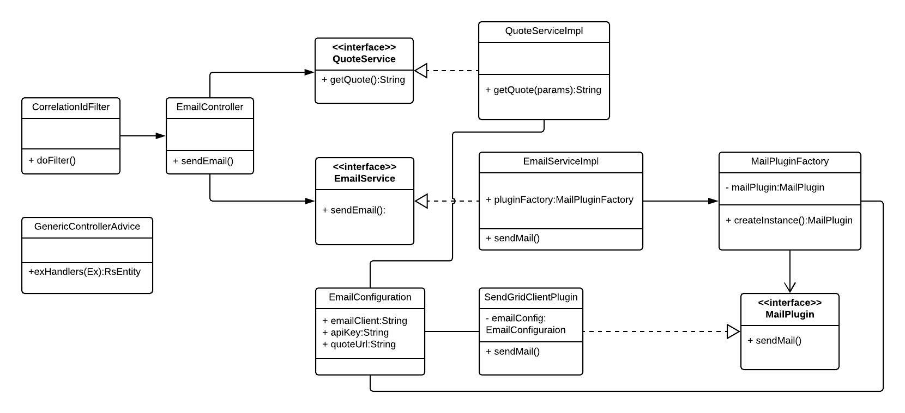

# Email Service API
This REST API allows sending an email to one or more recipients.

## Swagger API Spec
Version 1 API specification can be found here as api_specification_v1.yml.
Use https://editor.swagger.io/ for visualization

## Class Diagram


## Configuration
Following configuration can be found in the application.yml file in the resources folder

* emailClient: 3rd party service used for sending the emails Ex: sendgrid
* encryptionSecret: Master password used for encryption
* apiKey: Encrypted API Key
* fromAddress: From email addresss to be included in the email
* filterEmailsEnabled: Email filtering can be enabled or disabled Ex: true/false
* filterDomain: Email address domain name to be filtered. Ex: test.com - Only emails with test.com will be delivered
* quoteApiUrl: External API used to retreive quote of the day when the enrich request parameter is true Ex: https://talaikis.com/api/quotes/random/

NOTE: API Key is encrypted for security purposes
EncryptionUtilTest class can be used to encrypt the API key

## Startup the service
Use the following command to start up the email service v1.
```
DEV - java -jar target/email-service-1.0.jar 

PROD - java -jar -Dspring.profiles.active=prod target/email-service-1.0.jar

```

## Sample Request

TO, CC & BCC Email addresses can be specified in the request body as a comma seperated string
```
{
  "to":"rasanka@mailinator.com,rasanka1@mailinator.com",
  "cc":"rasanka.cc@mailinator.com",
  "bcc":"rasanka.bcc@mailinator.com",
  "body":"Test Email Content",
  "subject":"Test Subject"
}
```

CURL 
```
curl -X POST \
  'http://192.168.70.100:7070/api/v1/email?enrich=true' \
  -H 'Accept: application/json' \
  -H 'Content-Type: application/json' \
  -H 'Postman-Token: 4c2e859f-6112-4908-9d2b-62e3f67cd629' \
  -H 'X-Correlation-ID: 5152eb26-35af-4e02-a952-63e85e6b1fbb' \
  -H 'cache-control: no-cache' \
  -d '{
    "to":"rasanka@mailinator.com,rasanka1@mailinator.com",
    "cc":"rasanka.cc@mailinator.com",
    "bcc":"rasanka.bcc@mailinator.com",
    "body":"Test Email Content",
    "subject":"Test Subject"
    }'
```
## List of improvements

1. Implement request Authorization using Authorization header
2. Improve Test coverage
3. Improve validation and email content formatting
4. Adding support for multiple content types, attachments
5. Subject or email content base filtering for quotes & news 
6. Introduce a message queue for asynchronous processing

## Author
* Rasanka Jayawardana - rasanka.lk@gmail.com
